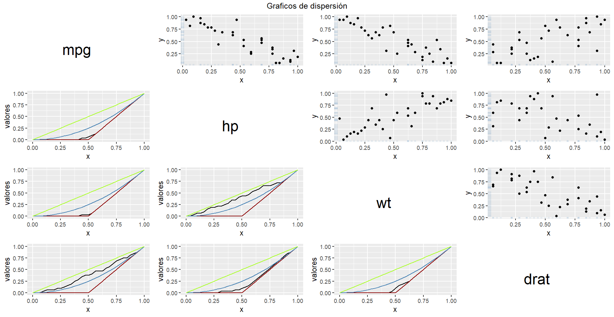
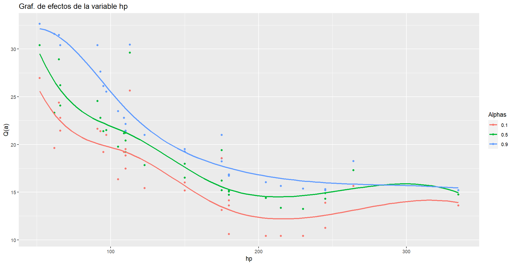

# Quantile Regression using D-vine Copulas
### Developer: Brenda Paola Quintana Silva

This library was developed to perform a Quantile Regression with the D-vine model. This technique consists of decomposing the distribution function into pairs of copulas, and a graph (which is a path) determines this factorization. The following article explains how to build it [D-vine copula based quantile regression](https://www.sciencedirect.com/science/article/abs/pii/S0167947316303073). Additionally, the ideas of the copulas visualizations implemented in the library are taken from the following article [Copula-based statistical dependence visualizations](https://arxiv.org/abs/2204.00265).

## How to install the package
You have to run the following code in the terminal.

```
devtools::install_github("BesitosDeBaba/deerVineReg")
```

## Example of using

Import libraries
```
library(deerVineReg)
```

Import Dataset
```
data <- mtcars
attach(data)
```

### Model Fits
**constCop** - Function that fits the D-vine model. You have to introduce:

- *formula* - formula like in addtive model $y \sim x_1 + x_2 + \dots + x_n$, where $y$ is the prediction variable and $x_1, x_2, \dots, x_n$ are covariates. 
- *data* - DataFrame to adjuste the model.
- *estima* - Boolean, True if you want to execute an algorithm that builds a path like the initial tree, maximizing Schweizer and Wolff sigma correlation.

**testCop** - This function prints the independent test p-value of each copula. You have to introduce:
- *model* - D-vine object
```
#Ajuste del modelo
model <- constCop(formula = mpg ~ wt + drat + hp, data, estima = TRUE)
testCop(model)
```

### Model Prediction
**regresionPred** -  This function makes a prediction given a set and a probability $\alpha$ in $[0, 1]$. 
You have to introduce:  

- *model* - D-vine object.
- *dataPred* - Data.frame with prediction covariates.
- *alpha* - An double, this the probability to make the quantile regression.
```
#Prediccion
pred <- regresionPred(model, model$data, 0.25)
```

### Visual Exploratory Analysis

These functions are implemented to visualize the shape of each copula. That allows you to view and compare the performance of each copula and the data fit. 

**diagonalGraf** - This function makes a graph that in triangular upper shows dispersion graphs and in triangular lower shows the diagnonal of reference copulas ($Pi$, $W$, $M$ and empirical copula, if you want to know how to interprete this graph read [this](	https://tesiunam.dgb.unam.mx/F?current_base=TES01&func=direct&doc_number=000691296)). You have to introduce: 

*model* - An D-vine object.

```
#Visualizacion del modelo
diagonalGraf(model)
```




**plot_effects** - An effects graph is a visual tool used to show how different factors or variables influence an outcome. You have to introduce:

- *model* - D-vine object.
- *var* - string with the name of covariate that you want to see the effect.
- *alphas* - vector, with probability $\alpha$ set to make the quantile regression.
```
plot_effects(model, 'hp', c(0.1, 0.5, 0.9))
```



**alleffect** - Make all effect graphs. You have to introduce:

- *model* - D-vine object.
- *alphas* - vector, with probability $\alpha$ set to make the quantile regression.
```
alleffect(model, alphas = c(0.1, 0.5, 0.9))
```

**HeatCopula** function that makes heat maps of a specific Copula. They are computed using the following formulas:

$$
\mathscr{H}_\sigma = 12\left|C_n\left( \frac{i}{n}, \frac{j}{n}\right)-\frac{i j}{n^2}\right|: i, j \in\{1, \ldots, n-1\},
$$

$$
\mathscr{H}_\rho = 12\left[C_n\left(\frac{i}{n}, \frac{j}{n}\right)-\frac{i j}{n^2}\right]: i, j \in\{1, \ldots, n-1\},
$$

$$
\mathscr{H} =  D_n\left( \frac{i}{n}, \frac{j}{n}\right) : i, j \in\{1, \ldots, n-1\},
$$

You have to introduce:

*model* - D-vine object.
*copName* - A string with the name of the copula that you want to know its behavior.

```
#Ver la forma especifica de una copula
heatsCopula(model, 'C12')
```


**ShowCopula** - Function that makes curves of level of a copula and diagonal copulas ($Pi$, $W$, $M$ and empirical copula). 
You have to introduce: 

- *model* - D-vine object.
- *copName* - A string with the name of the copula that you want to know its behavior.

```
showCopula(model, 'C12')
```


